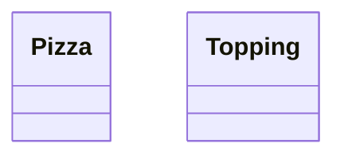
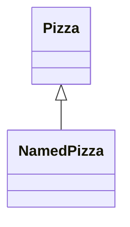
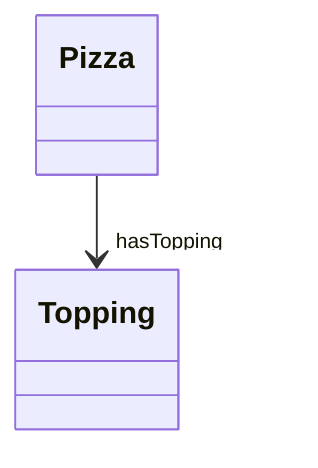
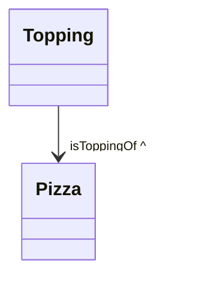
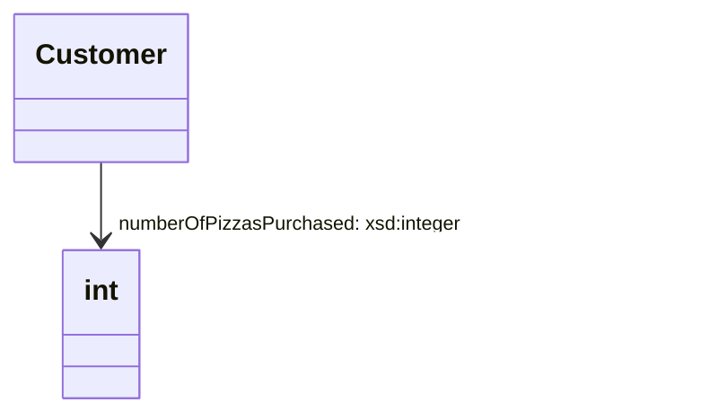
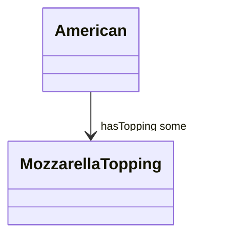
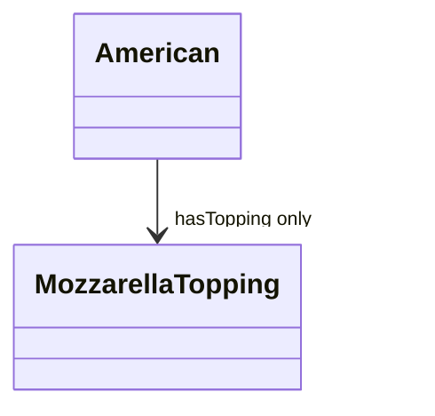
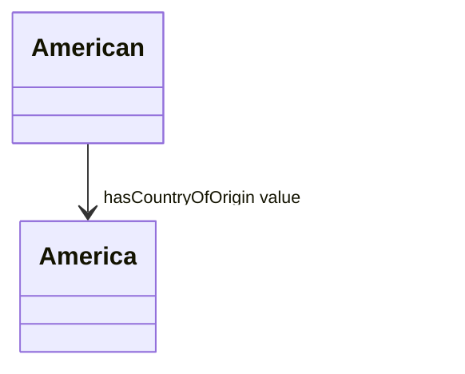
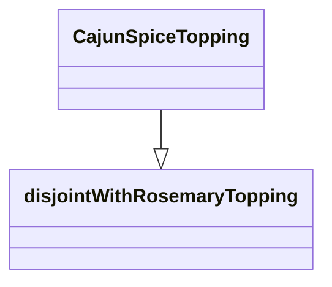
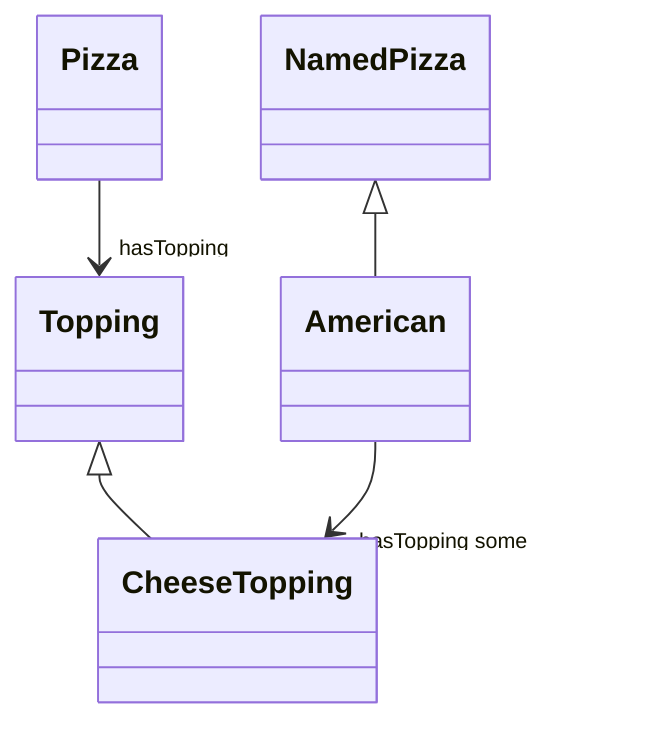

# Mermaid-OWL Lite (MOWL-Lite) Syntax Standard

## 1. Class Declarations



**OWL Equivalent:**

```ttl
:Pizza rdf:type owl:Class .
:Topping rdf:type owl:Class .
```

---

## 2. Subclass Relationships



**OWL Equivalent:**

```ttl
:NamedPizza rdfs:subClassOf :Pizza .
```

---

## 3. Object Properties (with optional labels)



**OWL Equivalent:**

```ttl
:hasTopping rdf:type owl:ObjectProperty ;
            rdfs:domain :Pizza ;
            rdfs:range :Topping .
```

You can also allow optional *inverse* by:



**OWL Equivalent:**

```ttl
:isToppingOf owl:inverseOf :hasTopping .
```

---

## 4. Data Properties



**OWL Equivalent:**

```ttl
:numberOfPizzasPurchased rdf:type owl:DatatypeProperty ;
                         rdfs:domain :Customer ;
                         rdfs:range xsd:integer .
```

Note: Use dummy node `int` to satisfy Mermaid rendering.

---

## 5. Restrictions

### someValuesFrom



**OWL Equivalent:**

```ttl
:American rdfs:subClassOf [
  rdf:type owl:Restriction ;
  owl:onProperty :hasTopping ;
  owl:someValuesFrom :MozzarellaTopping
] .
```

### allValuesFrom



### hasValue



---

## 6. Equivalence

```mermaid
classDiagram
CheeseyPizza "≡" Pizza & hasTopping some CheeseTopping
```

**OWL Equivalent:**

```ttl
:CheeseyPizza owl:equivalentClass [
  owl:intersectionOf (
    :Pizza
    [ rdf:type owl:Restriction ;
      owl:onProperty :hasTopping ;
      owl:someValuesFrom :CheeseTopping ]
  )
] .
```

Note: Use a parser-friendly rule to split on `&`.

---

## 7. Union Classes

```mermaid
classDiagram
PizzaTopping o-- "unionOf" (MeatTopping, CheeseTopping, VegetableTopping)
```

**OWL Equivalent:**

```ttl
:PizzaTopping owl:equivalentClass [
  owl:unionOf ( :MeatTopping :CheeseTopping :VegetableTopping )
] .
```

---

## 8. Disjoint Classes



**OWL Equivalent:**

```ttl
:CajunSpiceTopping owl:disjointWith :RosemaryTopping .
```

---

## Transformation Rules Summary

| Mermaid Pattern                | TTL Output                       |
|-------------------------------|---------------------------------|
| `A <|-- B`                    | `B rdfs:subClassOf A`           |
| `A --> "p" B`                 | `p` is an `owl:ObjectProperty`  |
| `A --> "p: xsd:type" dummy`   | `p` is an `owl:DatatypeProperty`|
| `"≡"`                         | Use `owl:equivalentClass`       |
| `"some"` / `"only"` / `"value"` | Create OWL restriction node    |
| `o-- "unionOf"`              | OWL `unionOf` class expression   |

---

## Example


